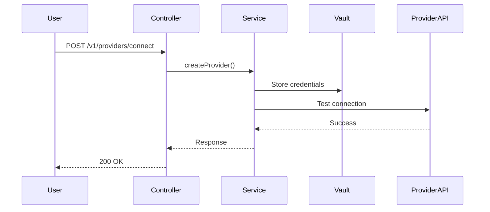

# Example API Documentation (Simplified)

## 1. Description

### Overview
Creates new provider connections, supporting both OAuth and API key authentication methods for cryptocurrency exchanges and traditional brokerages.

### Business Value
- **Portfolio Aggregation**: View all investments in one place
- **Unified Trading**: Trade across multiple platforms from single interface
- **Real-time Sync**: Maintain up-to-date portfolio data

### Key Use Cases
1. **Connect Exchange**: User connects Kraken or Binance US
2. **Connect Brokerage**: User connects Schwab or Alpaca
3. **OAuth Flow**: Authorization via OAuth (Coinbase, Alpaca)

## 2. API Specification

### Endpoint
```yaml
POST /v1/providers/connect
Content-Type: application/json
Authentication: Required (Bearer Token)
Rate Limit: 10 requests/minute
```

### Request
```typescript
interface CreateProviderRequest {
  userId: string;
  providerId: string;          // kraken, coinbase, alpaca, etc.
  connectionType: string;       // "api_key" or "oauth"
  apiKey?: string;
  apiSecret?: string;
}
```

### Response
```typescript
interface CreateProviderResponse {
  providerId: string;
  providerName: string;
  status: "connected" | "pending" | "failed";
  operationSuccess: boolean;
  authorizationUrl?: string;  // For OAuth
}
```

### Examples

**API Key Provider (Kraken)**
```bash
curl -X POST https://api.strategiz.io/v1/providers/connect \
  -H "Authorization: Bearer ${TOKEN}" \
  -d '{
    "userId": "user_123",
    "providerId": "kraken",
    "connectionType": "api_key",
    "apiKey": "YOUR_KEY",
    "apiSecret": "YOUR_SECRET"
  }'
```

**Response**
```json
{
  "providerId": "kraken",
  "providerName": "Kraken",
  "status": "connected",
  "operationSuccess": true
}
```

### Error Codes
| Code | Description |
|------|-------------|
| `PROVIDER_INVALID_CREDENTIALS` | Invalid API keys or OAuth tokens |
| `PROVIDER_CONNECTION_FAILED` | Network or provider API issue |
| `INVALID_PROVIDER_TYPE` | Provider ID not supported |

## 3. Design

### Flow


## 4. Quality

### Testing
**Coverage**: 85% overall
- Controller: 92% (15 tests)
- Service: 88% (23 tests)
- Business: 85% (31 tests)

### Observability

**Logging**
```java
log.info("Creating provider {} for user: {}", providerId, userId);
log.error("Provider connection failed: {}", error);
```

**Metrics**
- `provider_creation_total` - Total creations
- `provider_creation_duration_seconds` - Latency
- `provider_connection_success_rate` - Success %

**Alerts**
- High Error Rate: error_rate > 5% for 5 min → WARNING
- Vault Failure: vault_available == 0 for 1 min → CRITICAL

**SLO**: 99.9% availability, P95 < 500ms, < 1% error rate

### Security
- Authentication: Bearer token required
- Authorization: Users can only create their own providers
- Data Protection: Credentials stored in HashiCorp Vault (AES-256)
- Compliance: GDPR, PCI DSS, SOC 2 Type II

## 5. Maintenance

### Known Issues
- Kraken API may require OTP for some operations (not yet supported)

### Future Enhancements
- [ ] Add Robinhood support
- [ ] Implement credential rotation reminders
- [ ] Add bulk provider connection

### Contact
- **Team**: Platform Integration Team
- **Slack**: #platform-providers
- **Docs**: https://docs.strategiz.io/providers

---

**Line count**: ~150 lines (vs. 600+ in full template)
