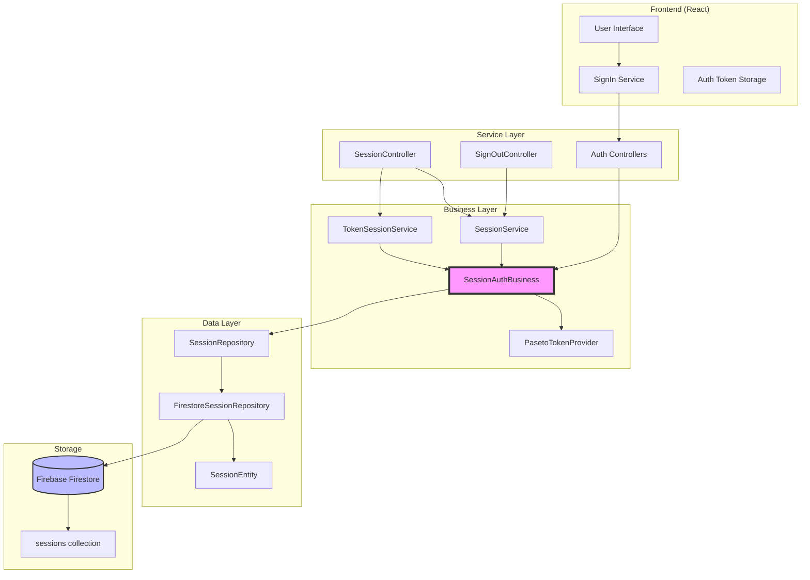
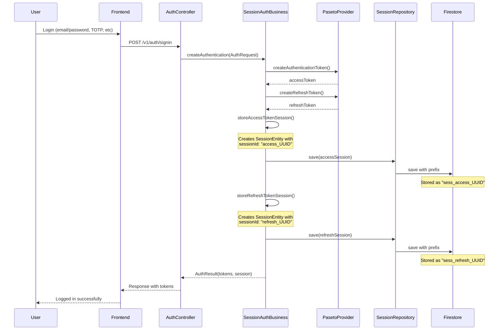
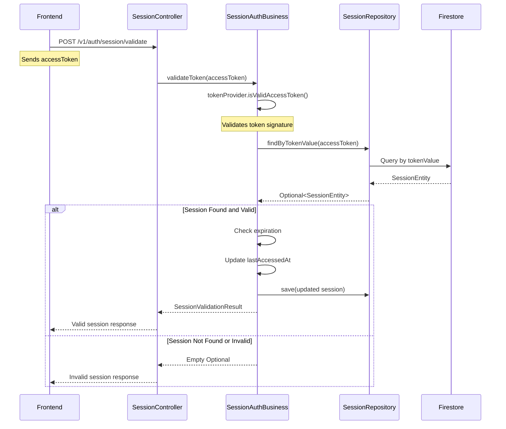
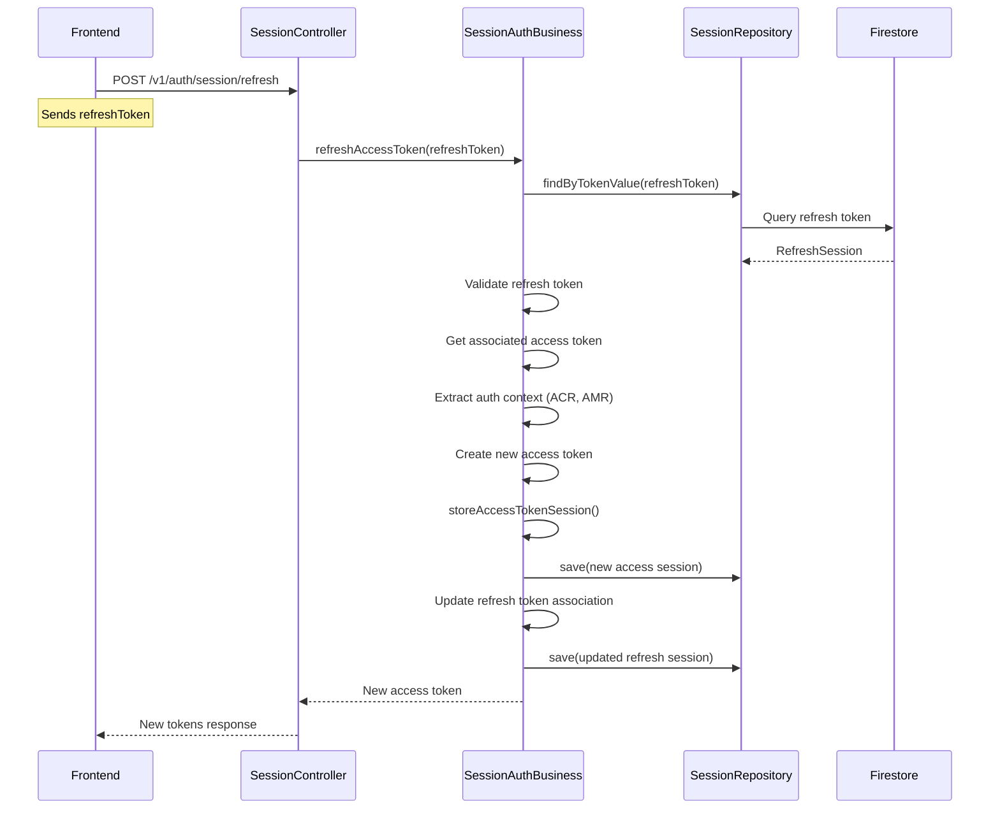
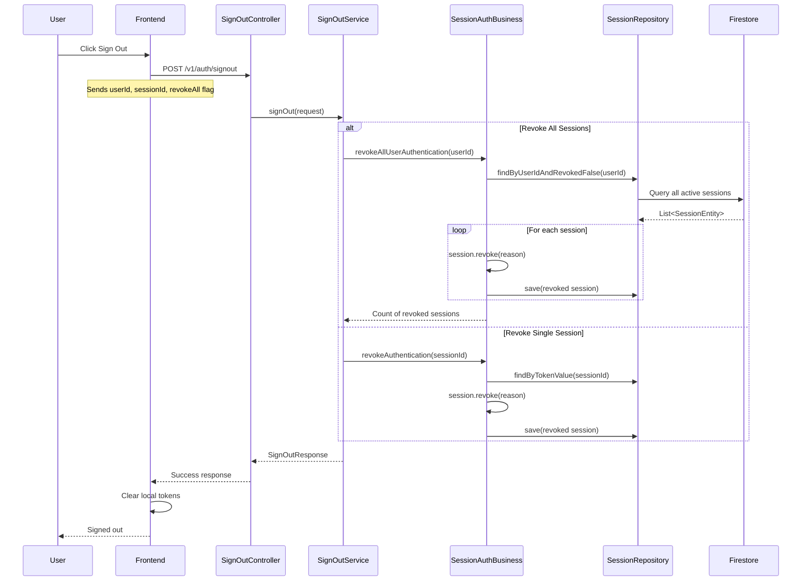
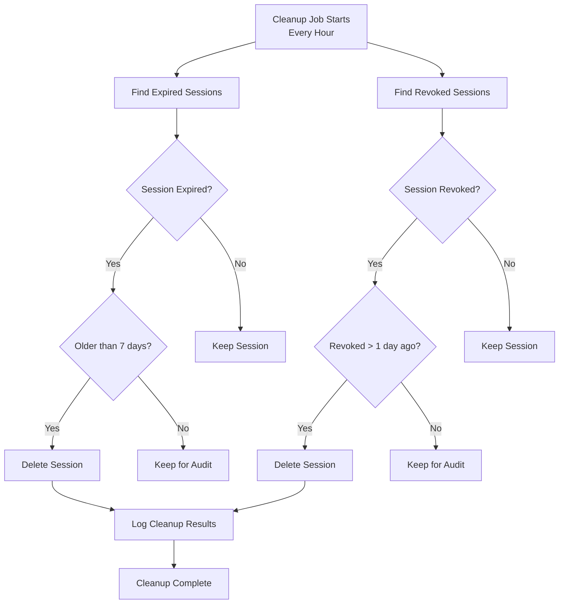

# Session Management Documentation

## Table of Contents
- [Overview](#overview)
- [Architecture](#architecture)
- [Component Diagram](#component-diagram)
- [Session Lifecycle](#session-lifecycle)
- [API Endpoints](#api-endpoints)
- [Session Storage](#session-storage)
- [Security Features](#security-features)
- [Cleanup and Retention](#cleanup-and-retention)

## Overview

The Strategiz platform implements a comprehensive session management system using PASETO tokens stored in Firebase Firestore. This document covers the complete session management architecture, including authentication flows, session lifecycle, and cleanup policies.

### Key Features
- **PASETO Token-based Authentication**: Secure, modern token format
- **Dual Token System**: Access tokens (24h) and refresh tokens (7-30 days)
- **Firestore Session Storage**: Persistent session storage with TTL
- **Automatic Cleanup**: Scheduled cleanup with retention policies
- **Multi-factor Authentication Support**: ACR levels and AMR tracking
- **Device Fingerprinting**: Track sessions by device

## Architecture

### Component Diagram



### Draw.io Component Diagram

<details>
<summary>Click to view Draw.io XML (import into draw.io)</summary>

```xml
<?xml version="1.0" encoding="UTF-8"?>
<mxfile host="app.diagrams.net">
  <diagram name="Session Management Architecture" id="session-architecture">
    <mxGraphModel dx="1426" dy="794" grid="1" gridSize="10" guides="1" tooltips="1" connect="1" arrows="1" fold="1" page="1" pageScale="1" pageWidth="827" pageHeight="1169" math="0" shadow="0">
      <root>
        <mxCell id="0" />
        <mxCell id="1" parent="0" />
        
        <!-- Frontend Layer -->
        <mxCell id="frontend-layer" value="Frontend Layer (React)" style="swimlane;fillColor=#dae8fc;strokeColor=#6c8ebf;" vertex="1" parent="1">
          <mxGeometry x="40" y="40" width="740" height="140" as="geometry" />
        </mxCell>
        <mxCell id="signin-service" value="SignIn Service" style="rounded=1;whiteSpace=wrap;html=1;fillColor=#fff2cc;strokeColor=#d6b656;" vertex="1" parent="frontend-layer">
          <mxGeometry x="30" y="40" width="120" height="60" as="geometry" />
        </mxCell>
        <mxCell id="auth-storage" value="Token Storage&#xa;(Cookies)" style="rounded=1;whiteSpace=wrap;html=1;fillColor=#fff2cc;strokeColor=#d6b656;" vertex="1" parent="frontend-layer">
          <mxGeometry x="180" y="40" width="120" height="60" as="geometry" />
        </mxCell>
        
        <!-- Service Layer -->
        <mxCell id="service-layer" value="Service Layer (Controllers)" style="swimlane;fillColor=#d5e8d4;strokeColor=#82b366;" vertex="1" parent="1">
          <mxGeometry x="40" y="200" width="740" height="140" as="geometry" />
        </mxCell>
        <mxCell id="session-controller" value="SessionController" style="rounded=1;whiteSpace=wrap;html=1;fillColor=#e1d5e7;strokeColor=#9673a6;" vertex="1" parent="service-layer">
          <mxGeometry x="30" y="40" width="120" height="60" as="geometry" />
        </mxCell>
        <mxCell id="signout-controller" value="SignOutController" style="rounded=1;whiteSpace=wrap;html=1;fillColor=#e1d5e7;strokeColor=#9673a6;" vertex="1" parent="service-layer">
          <mxGeometry x="180" y="40" width="120" height="60" as="geometry" />
        </mxCell>
        <mxCell id="auth-controllers" value="Auth Controllers&#xa;(TOTP, SMS, etc)" style="rounded=1;whiteSpace=wrap;html=1;fillColor=#e1d5e7;strokeColor=#9673a6;" vertex="1" parent="service-layer">
          <mxGeometry x="330" y="40" width="120" height="60" as="geometry" />
        </mxCell>
        
        <!-- Business Layer -->
        <mxCell id="business-layer" value="Business Layer" style="swimlane;fillColor=#ffe6cc;strokeColor=#d79b00;" vertex="1" parent="1">
          <mxGeometry x="40" y="360" width="740" height="140" as="geometry" />
        </mxCell>
        <mxCell id="session-auth-business" value="SessionAuthBusiness" style="rounded=1;whiteSpace=wrap;html=1;fillColor=#f8cecc;strokeColor=#b85450;strokeWidth=3;" vertex="1" parent="business-layer">
          <mxGeometry x="30" y="40" width="150" height="60" as="geometry" />
        </mxCell>
        <mxCell id="paseto-provider" value="PasetoTokenProvider" style="rounded=1;whiteSpace=wrap;html=1;fillColor=#fff2cc;strokeColor=#d6b656;" vertex="1" parent="business-layer">
          <mxGeometry x="210" y="40" width="140" height="60" as="geometry" />
        </mxCell>
        <mxCell id="session-service" value="SessionService" style="rounded=1;whiteSpace=wrap;html=1;fillColor=#fff2cc;strokeColor=#d6b656;" vertex="1" parent="business-layer">
          <mxGeometry x="380" y="40" width="120" height="60" as="geometry" />
        </mxCell>
        
        <!-- Data Layer -->
        <mxCell id="data-layer" value="Data Layer" style="swimlane;fillColor=#f5f5f5;strokeColor=#666666;" vertex="1" parent="1">
          <mxGeometry x="40" y="520" width="740" height="140" as="geometry" />
        </mxCell>
        <mxCell id="session-repository" value="SessionRepository&#xa;(Interface)" style="rounded=1;whiteSpace=wrap;html=1;fillColor=#dae8fc;strokeColor=#6c8ebf;" vertex="1" parent="data-layer">
          <mxGeometry x="30" y="40" width="120" height="60" as="geometry" />
        </mxCell>
        <mxCell id="firestore-repository" value="FirestoreSessionRepository&#xa;(Implementation)" style="rounded=1;whiteSpace=wrap;html=1;fillColor=#dae8fc;strokeColor=#6c8ebf;" vertex="1" parent="data-layer">
          <mxGeometry x="180" y="40" width="150" height="60" as="geometry" />
        </mxCell>
        <mxCell id="session-entity" value="SessionEntity" style="rounded=1;whiteSpace=wrap;html=1;fillColor=#dae8fc;strokeColor=#6c8ebf;" vertex="1" parent="data-layer">
          <mxGeometry x="360" y="40" width="120" height="60" as="geometry" />
        </mxCell>
        
        <!-- Storage Layer -->
        <mxCell id="storage-layer" value="Storage Layer" style="swimlane;fillColor=#e6f2ff;strokeColor=#4d94ff;" vertex="1" parent="1">
          <mxGeometry x="40" y="680" width="740" height="140" as="geometry" />
        </mxCell>
        <mxCell id="firestore" value="Firebase Firestore" style="shape=cylinder3;whiteSpace=wrap;html=1;boundedLbl=1;backgroundOutline=1;size=15;fillColor=#6a9eff;fontColor=#ffffff;strokeColor=#3366cc;" vertex="1" parent="storage-layer">
          <mxGeometry x="180" y="30" width="150" height="80" as="geometry" />
        </mxCell>
        <mxCell id="sessions-collection" value="'sessions' collection" style="rounded=0;whiteSpace=wrap;html=1;fillColor=#b3d9ff;strokeColor=#3366cc;" vertex="1" parent="storage-layer">
          <mxGeometry x="360" y="50" width="120" height="40" as="geometry" />
        </mxCell>
        
        <!-- Connections -->
        <mxCell id="edge1" style="edgeStyle=orthogonalEdgeStyle;rounded=0;orthogonalLoop=1;jettySize=auto;html=1;" edge="1" parent="1" source="signin-service" target="auth-controllers">
          <mxGeometry relative="1" as="geometry" />
        </mxCell>
        <mxCell id="edge2" style="edgeStyle=orthogonalEdgeStyle;rounded=0;orthogonalLoop=1;jettySize=auto;html=1;" edge="1" parent="1" source="session-controller" target="session-auth-business">
          <mxGeometry relative="1" as="geometry" />
        </mxCell>
        <mxCell id="edge3" style="edgeStyle=orthogonalEdgeStyle;rounded=0;orthogonalLoop=1;jettySize=auto;html=1;" edge="1" parent="1" source="session-auth-business" target="firestore-repository">
          <mxGeometry relative="1" as="geometry" />
        </mxCell>
        <mxCell id="edge4" style="edgeStyle=orthogonalEdgeStyle;rounded=0;orthogonalLoop=1;jettySize=auto;html=1;" edge="1" parent="1" source="firestore-repository" target="firestore">
          <mxGeometry relative="1" as="geometry" />
        </mxCell>
      </root>
    </mxGraphModel>
  </diagram>
</mxfile>
```

</details>

## Session Lifecycle

### Session Creation Flow



### Session Validation Flow



### Session Refresh Flow



### Sign Out Flow



## API Endpoints

### SessionController Endpoints

| Endpoint | Method | Description | Request Body | Response |
|----------|--------|-------------|--------------|----------|
| `/v1/auth/session/refresh` | POST | Refresh access token | `RefreshSessionRequest` | `RefreshSessionResponse` |
| `/v1/auth/session/validate` | POST | Validate access token | `SessionValidationRequest` | `SessionValidationResponse` |
| `/v1/auth/session/revoke` | POST | Revoke specific session | `SessionRevocationRequest` | `RevocationResponse` |
| `/v1/auth/session/revoke-all/{userId}` | POST | Revoke all user sessions | Path param: userId | `RevokeAllResponse` |
| `/v1/auth/session/current-user` | POST | Get user from token | `SessionValidationRequest` | `CurrentUserResponse` |
| `/v1/auth/session/validate-server` | POST | Validate server session | HTTP Request | `SessionValidationResponse` |
| `/v1/auth/session/current-user-server` | POST | Get user from server session | HTTP Request | `CurrentUserResponse` |
| `/v1/auth/session/logout-server` | POST | Terminate server session | HTTP Request | `RevocationResponse` |
| `/v1/auth/session/user-sessions` | POST | Get all active sessions | HTTP Request | List of sessions |

### SignOutController Endpoints

| Endpoint | Method | Description | Request Body | Response |
|----------|--------|-------------|--------------|----------|
| `/v1/auth/signout` | POST | Sign out user | `SignOutRequest` | `SignOutResponse` |

#### SignOutRequest Structure
```json
{
  "userId": "string",
  "sessionId": "string",
  "deviceId": "string",
  "revokeAllSessions": boolean
}
```

## Session Storage

### SessionEntity Structure

Sessions are stored in Firestore with the following structure:

```javascript
{
  // Document ID (auto-prefixed with "sess_")
  "sessionId": "sess_access_UUID",
  
  // Core fields
  "userId": "user123",
  "tokenValue": "v2.local.PASETO_TOKEN_HERE",
  "tokenType": "ACCESS" | "REFRESH",
  
  // Timestamps
  "issuedAt": Timestamp,
  "expiresAt": Timestamp,
  "lastAccessedAt": Timestamp,
  
  // Device/Location
  "deviceId": "device_UUID",
  "ipAddress": "192.168.1.1",
  
  // Revocation
  "revoked": false,
  "revokedAt": Timestamp | null,
  "revocationReason": "string | null",
  
  // Authentication context
  "claims": {
    "acr": "1" | "2" | "3",  // Authentication Context Reference
    "amr": "password,totp",   // Authentication Methods Reference
    "scope": "permissions",
    "demoMode": true | false
  },
  
  // Firestore metadata
  "createdAt": Timestamp,
  "updatedAt": Timestamp,
  "isActive": true
}
```

### Session ID Naming Convention

- **Access tokens**: `sess_access_[UUID]`
- **Refresh tokens**: `sess_refresh_[UUID]`

The `sess_` prefix is added by FirestoreSessionRepository, while the business layer creates IDs with just `access_` or `refresh_` prefixes.

## Security Features

### Token Security
- **PASETO v2.local**: Encrypted, tamper-proof tokens
- **No JWT vulnerabilities**: PASETO prevents algorithm confusion attacks
- **Encrypted payload**: Token contents are encrypted, not just signed

### Session Security
- **HTTP-only cookies**: Tokens stored in secure, HTTP-only cookies
- **CSRF protection**: SameSite cookie attributes
- **IP validation**: Optional IP address checking
- **Device fingerprinting**: Track sessions by device

### Multi-Factor Authentication
- **ACR Levels**: Authentication Context Reference
  - Level 1: Single factor (password)
  - Level 2: Two factors (password + TOTP/SMS)
  - Level 3: Strong authentication (passkey)
- **AMR Tracking**: Authentication Methods Reference
  - Records all authentication methods used
  - Supports: password, sms_otp, totp, passkeys, email_otp

## Cleanup and Retention

### Automatic Cleanup Schedule

The system runs automated cleanup every hour (`@Scheduled(fixedRate = 3600000)`):

```java
// Configuration (application.properties)
session.cleanup.expired.days=7    // Keep expired sessions for 7 days
session.cleanup.revoked.days=1    // Keep revoked sessions for 1 day
```

### Cleanup Logic



### Retention Policies

| Session Type | Retention Period | Reason |
|--------------|------------------|--------|
| Active Sessions | Never deleted | User is actively using |
| Expired Sessions | 7 days after expiration | Audit trail, security analysis |
| Revoked Sessions | 1 day after revocation | Immediate audit needs |
| Invalid Sessions | Immediate | Security |

### Protection for Active Users

The cleanup process ensures active users are never affected:

1. **Never deletes valid sessions**: Only expired or revoked sessions are considered
2. **Retention period buffer**: Even expired sessions kept for 7 days
3. **Explicit revocation check**: Must be explicitly revoked AND past retention
4. **Timestamp validation**: Checks both expiration and revocation timestamps

## Error Handling

### Common Error Scenarios

| Error | HTTP Status | Error Code | Description |
|-------|-------------|------------|-------------|
| Invalid Token | 401 | `INVALID_TOKEN` | Token signature invalid or malformed |
| Expired Token | 401 | `TOKEN_EXPIRED` | Token has expired |
| Session Not Found | 404 | `SESSION_NOT_FOUND` | No session found for token |
| Refresh Token Invalid | 401 | `REFRESH_TOKEN_INVALID` | Refresh token invalid or expired |
| User Not Found | 404 | `USER_NOT_FOUND` | User ID in token doesn't exist |

## Best Practices

### For Developers

1. **Always validate sessions** server-side, never trust client-side validation
2. **Use refresh tokens** to maintain long sessions without compromising security
3. **Implement proper logout** that revokes tokens server-side
4. **Monitor session metrics** for suspicious activity
5. **Set appropriate TTLs** based on application security requirements

### For Operations

1. **Monitor cleanup jobs** to ensure they're running successfully
2. **Adjust retention policies** based on compliance requirements
3. **Set up alerts** for excessive session creation or revocation
4. **Regular security audits** of session data
5. **Backup session data** before major cleanup operations

## Testing

### Unit Tests
- `SessionAuthBusinessTest`: Business logic testing
- `SessionControllerTest`: Endpoint testing
- `FirestoreSessionRepositoryTest`: Repository testing

### Integration Tests
- End-to-end authentication flows
- Session lifecycle testing
- Cleanup job testing

### Load Tests
- Concurrent session creation
- High-volume validation requests
- Cleanup performance with large datasets

## Monitoring and Observability

### Key Metrics

- **Session Creation Rate**: New sessions per minute
- **Session Validation Rate**: Validations per second
- **Active Session Count**: Total active sessions
- **Expired Session Count**: Sessions awaiting cleanup
- **Cleanup Duration**: Time taken for cleanup job
- **Token Refresh Rate**: Refresh requests per minute

### Logging

Important log points:
- Session creation: INFO level
- Session validation: DEBUG level
- Session revocation: INFO level
- Cleanup operations: INFO level with counts
- Errors: ERROR level with stack traces

## Future Enhancements

1. **Session Analytics Dashboard**: Real-time session monitoring
2. **Geo-location Tracking**: Track session locations
3. **Anomaly Detection**: ML-based suspicious activity detection
4. **Session Sharing**: Allow session sharing across devices
5. **Session Export**: Allow users to export their session history
6. **WebSocket Support**: Real-time session updates
7. **Rate Limiting**: Per-user session creation limits

## Related Documentation

- [Authentication Overview](./README.md)
- [TOTP Flow](./TOTP.md)
- [Signup Flow Guide](./signup-flow-guide.md)
- [Main Project README](../../../README.md)