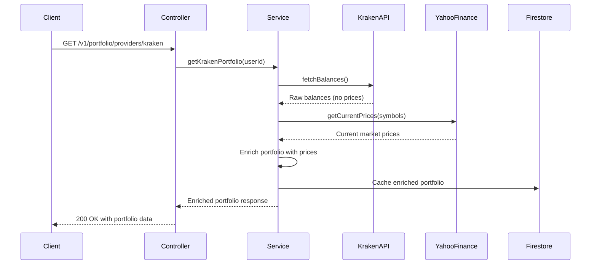

# Portfolio Service Diagrams

This directory contains architectural diagrams and visual documentation for the service-portfolio module.

## Available Diagrams

### Architecture Diagrams
- Portfolio data flow diagrams
- Provider integration architecture
- Market data enrichment flow
- Aggregation patterns

### Sequence Diagrams
- Portfolio summary request flow
- Provider-specific portfolio fetch
- Refresh operation sequence
- Trade history retrieval

### Data Flow Diagrams
- Kraken integration data flow
- Yahoo Finance price enrichment
- Multi-provider aggregation
- Cache invalidation flow

## Creating New Diagrams

When adding new diagrams to this directory:

1. **Format**: Use Mermaid.js or standard image formats (PNG, SVG)
2. **Naming**: Use descriptive, kebab-case names (e.g., `portfolio-aggregation-flow.mmd`)
3. **Documentation**: Reference diagrams from controller documentation
4. **Source Files**: Keep source files (.mmd, .drawio) for future editing

## Diagram Tools

Recommended tools for creating diagrams:

- **Mermaid.js**: For sequence diagrams and flowcharts
- **Draw.io**: For complex architecture diagrams
- **PlantUML**: For UML diagrams
- **Lucidchart**: For collaborative diagramming

## Example Mermaid Diagram

## Contributing

When adding diagrams:

1. Keep diagrams simple and focused on a single concept
2. Use consistent styling and colors
3. Include legends and labels for clarity
4. Update this README with diagram descriptions
5. Reference diagrams in the appropriate MDX documentation
