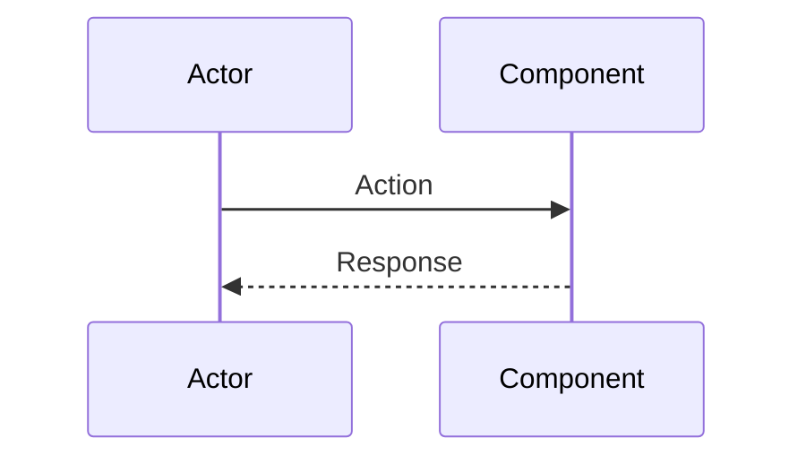

# [API Name] Documentation

## 1. Business Purpose

### Overview
[Brief description of what this controller does and why it exists]

### Business Value
- **[Value Point 1]**: [Description]
- **[Value Point 2]**: [Description]
- **[Value Point 3]**: [Description]

### Key Use Cases
1. **[Use Case 1]**: [Description]
2. **[Use Case 2]**: [Description]
3. **[Use Case 3]**: [Description]

## 2. Technical Specifications

### Endpoint Details
```yaml
Path: /v1/[resource]/[action]
Method: [GET|POST|PUT|DELETE|PATCH]
Content-Type: application/json
Authentication: [Required/Optional] ([Auth Type])
Rate Limit: [X] requests per [time period]
```

### Request Schema
```typescript
interface [RequestName] {
  // Define request structure
}
```

### Response Schema
```typescript
interface [ResponseName] {
  // Define response structure
}
```

### Error Codes
| Code | Message | Description |
|------|---------|-------------|
| `ERROR_CODE_1` | Error message | Detailed description |
| `ERROR_CODE_2` | Error message | Detailed description |

## 3. Design

### 3.1 Flow Diagram
```drawio
<mxfile host="app.diagrams.net">
  <diagram name="[Flow Name]" id="[unique-id]">
    <!-- Add draw.io XML here -->
  </diagram>
</mxfile>
```

### 3.2 Component Diagram
```drawio
<mxfile host="app.diagrams.net">
  <diagram name="[Component Name]" id="[unique-id]">
    <!-- Add draw.io XML here -->
  </diagram>
</mxfile>
```

### 3.3 Sequence Diagram


## 4. API Specifications

### 4.1 Sample Request
```bash
curl -X [METHOD] https://api.strategiz.io/v1/[endpoint] \
  -H "Authorization: Bearer ${AUTH_TOKEN}" \
  -H "Content-Type: application/json" \
  -d '{
    "field": "value"
  }'
```

### 4.2 Sample Response - Success
```json
{
  "field": "value"
}
```

### 4.3 Sample Error Response
```json
{
  "error": {
    "code": "ERROR_CODE",
    "message": "Error message",
    "details": {}
  }
}
```

## 5. Code Quality Metrics

### 5.1 Code Coverage
```yaml
Overall Coverage: XX%
Line Coverage: XX%
Branch Coverage: XX%
Function Coverage: XX%
```

### 5.2 Complexity Metrics
```yaml
Cyclomatic Complexity: X
Cognitive Complexity: X
Lines of Code: XXX
Number of Methods: X
```

### 5.3 Security Analysis
```yaml
SAST Scan: [Status]
Secrets Detection: [Status]
Dependency Vulnerabilities: X High, X Medium, X Low
OWASP Top 10: [Compliant/Non-compliant]
```

### 5.4 Performance Metrics
```yaml
Average Response Time: XXXms
P95 Response Time: XXXms
P99 Response Time: XXXms
Throughput: XXX requests/second
```

## 6. Testing

### 6.1 Unit Tests
```java
@Test
public void test[MethodName]_[Scenario]_[ExpectedResult]() {
    // Given
    // When
    // Then
}
```

### 6.2 Integration Tests
```java
@SpringBootTest
@AutoConfigureMockMvc
public class [ControllerName]IntegrationTest {
    // Integration test code
}
```

### 6.3 Test Coverage Report
| Component | Coverage | Tests |
|-----------|----------|-------|
| Controller | XX% | XX |
| Service | XX% | XX |
| Business | XX% | XX |

### 6.4 Load Testing Results
```yaml
Test Scenario: [Description]
Duration: X minutes
Success Rate: XX%
Average Response: XXXms
Errors: X
```

## 7. Observability & Monitoring

### 7.1 Logging
```java
// Key log points
log.info("[Action description]");
log.error("[Error description]");
log.debug("[Debug information]");
```

### 7.2 Metrics
```yaml
Metrics Collected:
- [metric_name] (Type)
- [metric_name] (Type)
```

### 7.3 Tracing
```yaml
Trace Points:
- [Trace Point 1]: [Description]
- [Trace Point 2]: [Description]
```

### 7.4 Alerts Configuration
```yaml
Alerts:
- Name: [Alert Name]
  Condition: [Condition]
  Duration: X minutes
  Severity: [CRITICAL|WARNING|INFO]
```

### 7.5 Dashboard Panels
1. **[Panel Name]**: [Description]
2. **[Panel Name]**: [Description]

### 7.6 SLIs and SLOs
```yaml
SLI (Service Level Indicators):
- [Indicator]: [Description]

SLO (Service Level Objectives):
- [Objective]: [Target]
```

## 8. Security Considerations

### 8.1 Authentication & Authorization
[Describe security measures]

### 8.2 Data Protection
[Describe data protection measures]

### 8.3 Compliance
[List compliance requirements]

## 9. Maintenance & Support

### 9.1 Known Issues
- [Issue description]

### 9.2 Future Enhancements
- [ ] [Enhancement 1]
- [ ] [Enhancement 2]

### 9.3 Contact & Support
- **Team**: [Team Name]
- **Slack Channel**: #[channel-name]
- **On-Call**: [email]
- **Documentation**: [URL]

## 10. Version History

| Version | Date | Changes | Author |
|---------|------|---------|--------|
| 1.0.0 | YYYY-MM-DD | Initial documentation | [Author] |

---

*This document is maintained by [Team Name]. For updates or corrections, please submit a PR to the [module-name] module.*