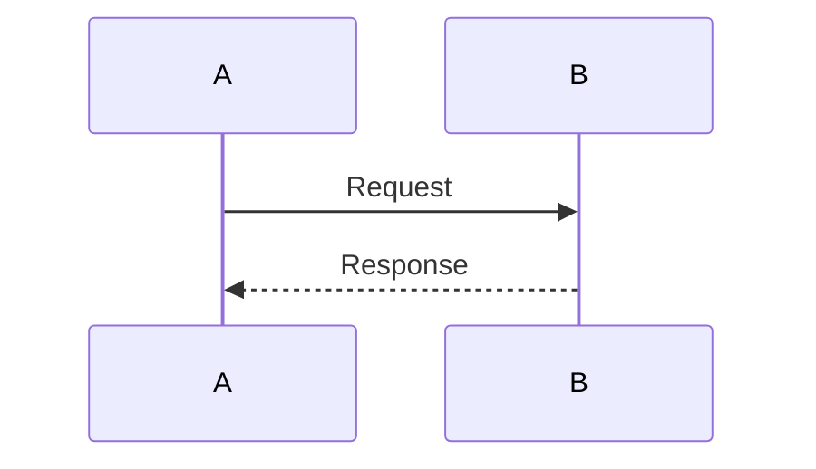

# API Documentation Template

## 1. Description (Business Purpose)

### Overview
[Brief overview of what this API does]

### Business Value
- Value point 1
- Value point 2

### Key Use Cases
1. Use case 1
2. Use case 2

## 2. Product and Technical Specifications

### 2.1 Functional Requirements
- FR-1: [Requirement]
- FR-2: [Requirement]

### 2.2 Non-functional Requirements

#### Performance Requirements
- NFR-P1: P95 response time < Xms
- NFR-P2: Throughput X requests/second

#### Scalability Requirements
- NFR-S1: Handle X concurrent requests
- NFR-S2: Auto-scaling enabled

#### Reliability Requirements
- NFR-R1: X% uptime SLA
- NFR-R2: Success rate > X%

#### Security Requirements
- NFR-SEC1: TLS 1.3 required
- NFR-SEC2: Authentication required
- NFR-SEC3: Rate limiting enabled

#### Maintainability Requirements
- NFR-M1: Code coverage > X%
- NFR-M2: Comprehensive logging

### 2.3 Endpoint Details
```yaml
Path: /v1/...
Method: GET/POST/PUT/DELETE
Content-Type: application/json
Authentication: Required/Optional
Rate Limit: X requests per minute
```

### 2.4 Request Schema
```typescript
interface RequestType {
  field1: string;
  field2: number;
}
```

### 2.5 Response Schema
```typescript
interface ResponseType {
  success: boolean;
  data: any;
}
```

### 2.6 Error Codes
| Code | Message | Description |
|------|---------|-------------|
| `error_1` | Error message | Description |

## 3. API Specifications (Redocly)

### 3.1 OpenAPI Specification
```yaml
openapi: 3.0.3
info:
  title: API Name
  version: 1.0.0
```

### 3.2 Sample Request
```bash
curl -X POST https://api.strategiz.io/v1/... \
  -H "Authorization: Bearer ${TOKEN}"
```

### 3.3 Sample Response - Success
```json
{
  "success": true
}
```

### 3.4 Sample Error Response
```json
{
  "error": {
    "code": "ERROR_CODE",
    "message": "Error message"
  }
}
```

## 4. Design Documentation

### 4.1 Component Diagram
[Draw.io diagram or ASCII art]

### 4.2 Flow Diagram
[Process flow visualization]

### 4.3 Sequence Diagram


## 5. Quality

### 5.1 Testing

#### Unit Tests
```java
@Test
public void testExample() {
    // Test code
}
```

#### Integration Tests
```java
@SpringBootTest
public void testIntegration() {
    // Test code
}
```

#### Test Coverage Report
| Component | Coverage | Tests |
|-----------|----------|-------|
| Controller | X% | N |
| Service | X% | N |

#### Load Testing Results
```yaml
Concurrent Users: X
Success Rate: X%
Average Response: Xms
```

### 5.2 Code Quality Metrics

#### Code Coverage
```yaml
Overall Coverage: X%
Line Coverage: X%
Branch Coverage: X%
```

#### Complexity Metrics
```yaml
Cyclomatic Complexity: X
Lines of Code: X
```

#### Security Analysis
```yaml
SAST Scan: Passed
Dependency Vulnerabilities: 0 High
OWASP Top 10: Compliant
```

#### Performance Benchmarks
```yaml
P95 Response Time: Xms
Throughput: X req/sec
```

### 5.3 Observability & Monitoring

#### Logging Strategy
```java
log.info("Event", Map.of("key", "value"));
```

#### Metrics Collection
```yaml
- metric_name_total (Counter)
- metric_duration_seconds (Histogram)
```

#### Distributed Tracing
- Trace point 1
- Trace point 2

#### Alerts Configuration
```yaml
- Name: Alert Name
  Condition: condition
  Severity: WARNING/CRITICAL
```

#### Dashboard Panels
1. Panel 1
2. Panel 2

#### SLIs and SLOs
```yaml
SLO:
  - Availability: X%
  - Latency: P95 < Xms
  - Success Rate: > X%
Error Budget Policy: [Policy details]
```

## 6. Security Considerations

### Authentication & Authorization
- Auth mechanism details

### Data Protection
- In transit: TLS 1.3
- At rest: Encryption details

### Security Testing
- SAST: Tool and results
- DAST: Tool and results
- Dependency Scanning: Results

### Compliance & Standards
- GDPR: Compliance details
- PCI DSS: If applicable
- SOC 2: Certification details
- OWASP: Compliance

### Security Incident Response
- Response plan details

## 7. Maintenance & Support

### Known Issues
- Issue 1
- Issue 2

### Future Enhancements
- [ ] Enhancement 1
- [ ] Enhancement 2

### Runbooks & Troubleshooting
- Problem 1: Solution
- Problem 2: Solution

### Deployment & Rollback
- Deployment process
- Rollback procedure

### Contact & Support
- **Team**: Team Name
- **Slack Channel**: #channel
- **On-Call**: email@company.com

## 8. Version History

| Version | Date | Changes | Author |
|---------|------|---------|--------|
| 1.0.0 | YYYY-MM-DD | Initial | Team |
